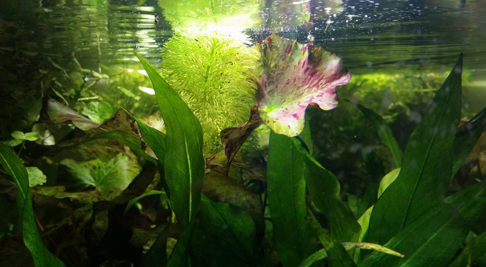
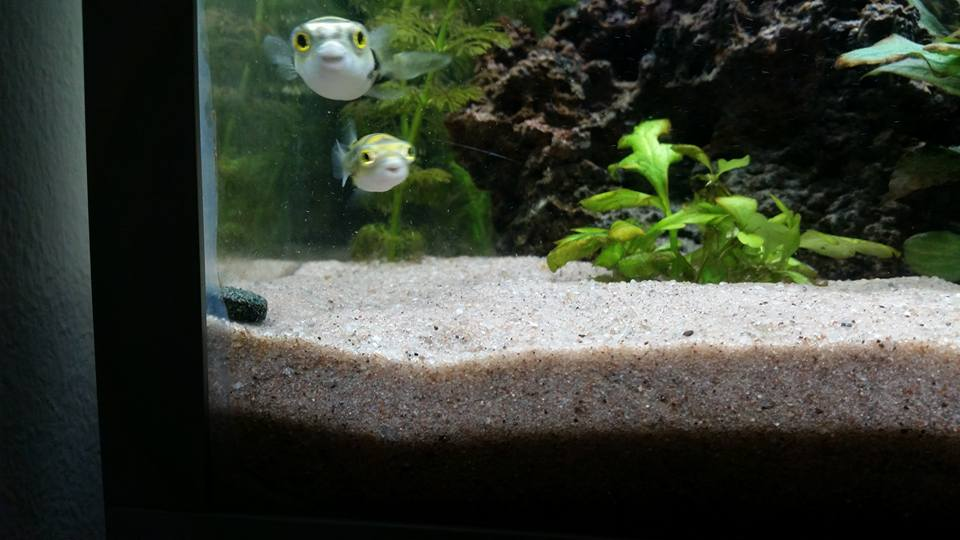
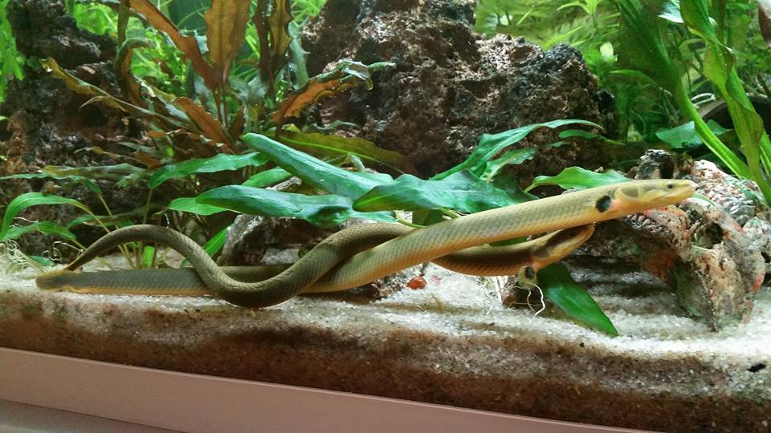

# About my journey

I have had an interesting journey in my life to this point, where I have two professions, neither of which were pobbile for me to work in after an occupational accident that occured. I decided that I had to do something in my life to keep me in right mind and also to make another professsion possible if it turns out that I could never return to my old professions. That is why I participated in these distance learning opportunities and tried to collect as wide-based collection of courses as possible to provide me with good starting points to many different things. These are the reasons for me being on this course. I have had an interest for ICT already from my childhood, but I never have actually considered learning it or working with it before my accident. 

ICT is also nice to master and to behold for many kinds of uses at my home: I need surveillance for my different animals and some devices to work as needed like an aquarium LED-lighting (LED controlled sunrise in the morning - slowly, sundown an hour after that to repel algae growth, another sunrise at noon and lights on until the evening until sundown). Feel free to rest your eyes on the beautiful colors of the *Nymphaea lotus* (in Finnish tiikerilumme) and the goggly eyes of my *colomesus asellus* puffer fishes and my mighty *erpetoichthys calabaricus* reedfishes ***Kleopatra*** and ***Artemis***.

**Nymphaea lotus** (image rights are my own: ***Jack-in-a-box***)

**Colomesus asellus** (image rights are my own: ***Jack-in-a-box***)

**Erpetoichtys calabaricus** (image rights are my own: ***Jack-in-a-box***)

[*Link to my learning diary*](diary-066.md)